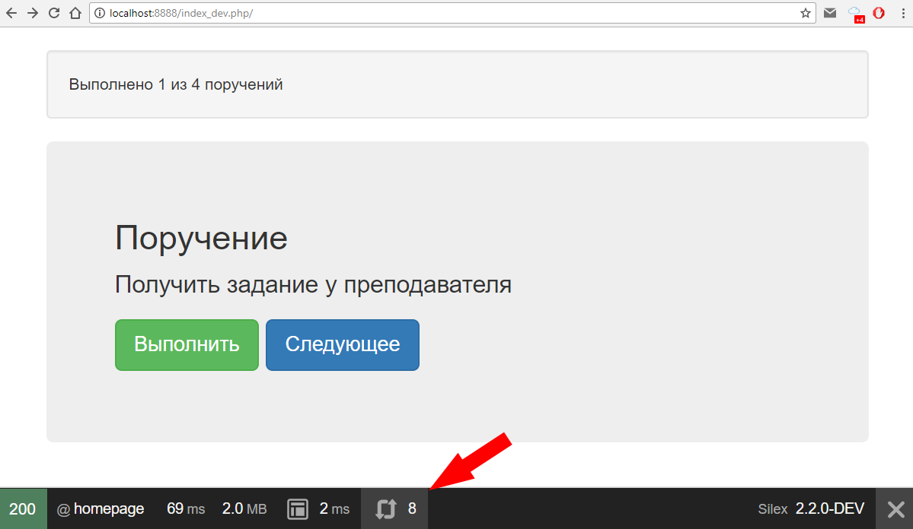
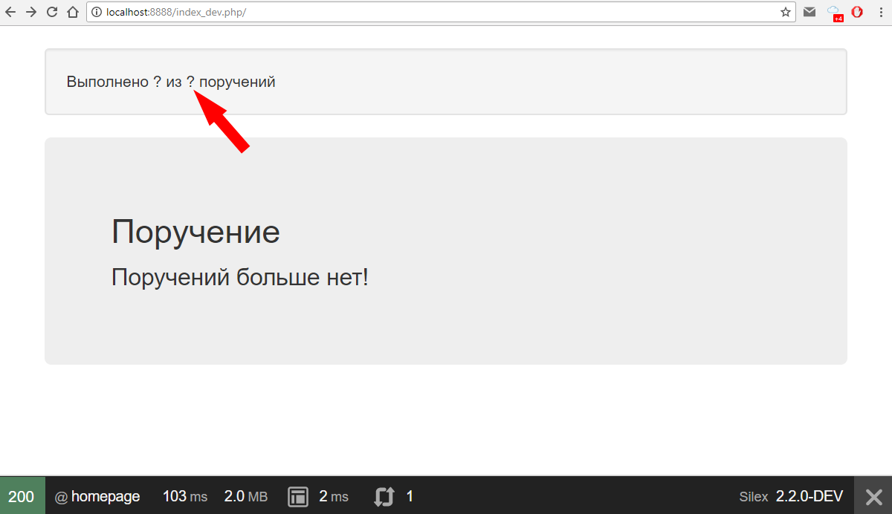

# Постановка задачи

Разработать модульное одностраничное приложение с подгрузкой информации через AJAX.

# Ход работы

### 1

Для того, чтобы использовать сторонние JS и CSS библиотеки, воспользуемся менеджером пакетов **Bower**.

Для начала, находясь в папке проекта *lab*, создадим *bower.json* с помощью команды:

```bash
bower init
```

На появляющихся предложениях ввода - просто прощелкиваем Enter, оставляя значения по умолчанию.

Теперь установим фреймворк Bootstrap:

```bash
bower install bootstrap
```

Он включает в себя и готовые файлы-стили, и свежую версию библиотеки **jQuery**.

Обратите внимание, скаченные с git-репозитория файлы библиотеки расположились в папке *bower_components*.

Теперь нужные нам файлы необходимо перенести в нашу рабочую папку *web*.

Для начала создаем папки *css* и *js* в папке *web*, если их нет. А далее копируем в них файлы:

```bash
copy bower_components\jquery\dist\jquery.min.js web\js\jquery.js
copy bower_components\bootstrap\dist\css\bootstrap.min.css web\css\bootstrap.css
```

### 2

Теперь данные файлы необходимо включить на страницу. Добавляем в файл *templates/layout.html.twig*:

1. в тег head - `<link href="{{ asset('css/bootstrap.css') }}" rel="stylesheet" type="text/css" />`
1. в конец body - `<script type="text/javascript" src="{{ asset('js/jquery.js') }}"></script>`

### 3

Создадим таблицу БД с данными, используя следующий скрипт:

```sql
CREATE TABLE IF NOT EXISTS `task` (
`id` int(11) NOT NULL,
  `text` varchar(256) NOT NULL,
  `status` enum('new','completed') NOT NULL DEFAULT 'new'
) ENGINE=InnoDB  DEFAULT CHARSET=utf8;

INSERT INTO `task` (`id`, `text`, `status`) VALUES
(1, 'Прочитать методические указания', 'completed'),
(2, 'Получить задание у преподавателя', 'new'),
(3, 'Ознакомиться с текстом лабораторной работы', 'new'),
(4, 'Выполнить лабораторную работу', 'new');

ALTER TABLE `task` ADD PRIMARY KEY (`id`);

ALTER TABLE `task` MODIFY `id` int(11) NOT NULL AUTO_INCREMENT;
```
### 4

На нашей странице будет 2 основных блока:

1. количество выполненных заданий из общего числа, который будет постоянно обновляться
1. поручением с 2-мя кнопками: исполнения и перехода к следующему

Все запросы будут осуществляться через AJAX с использованием **jQuery**.

Начинаем с определения контроллера (*src/controllers.php*):

```php
$app->get('stat', function () use ($app) {
    $sql = 'SELECT COUNT(*) AS count FROM task UNION SELECT COUNT(*) FROM task WHERE status = "completed"';

    $result = $app['db']->fetchAll($sql);
    
    return $app->json([
        'total'     => $result[0]['count'],
        'completed' => isset($result[1]) ? $result[1]['count'] : $result[0]['count'], # с обработкой на случай всех выполненных поручений
    ]);
})
;

$app->get('task/next', function (Request $request) use ($app) {
    $getParams = $request->query->all(); # получаем GET-параметры
    $after = isset($getParams['after']) ? (int) $getParams['after'] : 0;

    $sql = 'SELECT * FROM task WHERE status = "new" AND id > ? LIMIT 1';
    
    $task = $app['db']->fetchAssoc($sql, [$after]);

    return $app['twig']->render('task/item.html.twig', [
        'id'    => $task ? $task['id'] : 0,
        'text'  => $task ? $task['text'] : '',
    ]);
})
;

$app->post('task/{id}/complete', function ($id) use ($app) {
    $sql = 'UPDATE task SET status = "completed" WHERE id = ?';

    $id = $app['db']->executeUpdate($sql, [(int) $id]);
    if (!$id) {
        $app->error(function () { return new Response('Ошибка обновления БД'); });
    }

    return $app->json(['id' => $id]);
})
->assert('id', '\d+') # принимаем только цифры
;
```

В первом у нас возвращается JSON-ответ с цифрами, второй рендерит готовый html-кусок, третий через POST-запрос проставляет поручение выполненным.

### 5

Определяем шаблон для поручения (*templates/task/item.html.twig*):

```twig
<div class="jumbotron">
    <h2>Поручение</h2>
    
    <p>{{ text }}</p>
    <p>
        <a id="complete" class="btn btn-success btn-lg" data-id="{{ id }}">Выполнить</a>
        <a id="next" class="btn btn-primary btn-lg" data-id="{{ id }}">Следующее</a>
    </p>
    
        <p>{{ text|default('Поручений больше нет!') }}</p>
    
</div>
```
Через фильтр **default** можно определять значения, если они не заданы для шаблона.

Далее правим наш общий шаблон (*templates/layout.html.twig*) в соответствии с кодом:

```twig
<!DOCTYPE html>
<html>
    <head>
        <title>Lab #7</title>
        <link href="{{ asset('css/bootstrap.css') }}" rel="stylesheet" type="text/css" />
    </head>
    <body style="margin-top: 20px">
        <div class="container">
            
        </div>
        <script type="text/javascript" src="{{ asset('js/jquery.js') }}"></script>
        
    </body>
</html>
```

Обратите внимание на блок **js** - здесь мы определим свои скрипты для AJAX-запросов.

И, наконец, формируем шаблон главной страницы (*templates/index.html.twig*):

```twig



    <div class="well">Выполнено <span id="completed_task_count">?</span> из <span id="total_task_count">?</span> поручений</div>
    <div id="task">
        
    </div>



    <script type="text/javascript" src="{{ asset('js/main.js') }}"></script>

```

Здесь использована директива **include**, позволяющая подключать из шаблона другой шаблон с передачей параметров в JSON-формате.

Также мы подключили свой файл скрипта (*web/js/main.js*), заполним и его:

```js
// ежесекундно обновляем статистику
setInterval(() => {
    $.get('stat', (data) => {
        $('#completed_task_count').html(data.completed)
        $('#total_task_count').html(data.total)
    })
}, 1000)

/**
 * Вывод нового поручения
 *
 * @param afterId после данного номера
 */
let getNextTask = (afterId) => {
    $.get('task/next', {after: afterId}, (data) => {
        $('#task').html(data)
    })
}

$('#task').on('click', '#next', function () {
    const id = $(this).data('id') // выбирем номер текущего поручения из data-атрибута
    getNextTask(id) // делаем запрос на следующее
})

$('#task').on('click', '#complete', function () {
    const id = $(this).data('id')
    $.post('task/' + id + '/complete', (data) => {
        getNextTask(data.id)
    })
})

getNextTask(0) // выбираем первое поручение
```

Здесь мы определяем действие по таймеру - ежесекундное обновление статистики. Далее функцию, которая AJAX-запросом получает следующее поручение (принимает параметр - номер предыдущего поручения). Далее мы создаем обработчики кликов на кнопки со своими действиями. И в конце вызываем функцию для получения первого поручения.

### 6

Теперь посмотрим, что у нас должно получиться. Заходим на страницу http://localhost:8888/index_dev.php/ и видим:



Стрелочка указывает на debug-панель, в которой происходит считывание всех запросов со страницы. AJAX-запросы там также регистрируются. Поэтому если ничего не нажимать, то ежесекундно число будет увеличиваться.

Убеждаемся, что все кнопки рабочие. Для того, чтобы заново вернуться к невыполненным заданиям - необходимо перезагрузить страницу (Ctrl + F5).

Так как обновление статистической инфы происходит раз в секунду, то изначально вместо чисел пользователь увидит знаки вопроса, которые потом заменяться на данные из AJAX-запроса. И при выполнении всех поручений до первой секунды главная страница будет выглядеть так:



# Вывод

В ходе данной лабораторной работы создали полноценное одностраничное приложение, построенное на MVC-архитектуре по модульному принципу. Информация для каждого модуля подгружается через AJAX-запросы с использованием библиотеки jQuery.